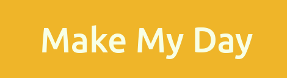

<!-- Improved compatibility of back to top link: See: https://github.com/othneildrew/Best-README-Template/pull/73 -->
<a name="readme-top"></a>

<!-- PROJECT SHIELDS -->
<!--
*** I'm using markdown "reference style" links for readability.
*** Reference links are enclosed in brackets [ ] instead of parentheses ( ).
*** See the bottom of this document for the declaration of the reference variables
*** for contributors-url, forks-url, etc. This is an optional, concise syntax you may use.
*** https://www.markdownguide.org/basic-syntax/#reference-style-links
-->
[![LinkedIn][linkedin-shield]][linkedin-url]


<!-- PROJECT LOGO -->
<br />
<div align="center">
  <a href="https://github.com/Gabor132/MakeMyDay">
    
  </a>

<h3 align="center">MakeMyDay</h3>

  <p align="center">
    Java Spring Web application used to krawl various other third-party event websites and centralizing all gathered information
  </p>
</div>


<!-- TABLE OF CONTENTS -->
<details>
  <summary>Table of Contents</summary>
  <ol>
    <li>
      <a href="#about-the-project">About The Project</a>
      <ul>
        <li><a href="#built-with">Built With</a></li>
      </ul>
    </li>
    <li>
      <a href="#getting-started">Getting Started</a>
      <ul>
        <li><a href="#prerequisites">Prerequisites</a></li>
        <li><a href="#installation">Installation</a></li>
      </ul>
    </li>
    <li><a href="#contact">Contact</a></li>
  </ol>
</details>


<!-- ABOUT THE PROJECT -->
## About The Project
    
![Product Name Screen Shot][product-screenshot]

Java Spring Web application used to krawl various other third-party event websites and centralizing all gathered information

<p align="right">(<a href="#readme-top">back to top</a>)</p>


### Built With

* [![Spring][Spring.com]][Spring-url]
* [![Bootstrap][Bootstrap.com]][Bootstrap-url]

<p align="right">(<a href="#readme-top">back to top</a>)</p>


<!-- GETTING STARTED -->
## Getting Started

### Prerequisites

* Maven
* JDK 8
* Docker

### Installation

1. Clone the repo
   ```sh
   git clone https://github.com/Gabor132/MakeMyDay.git
   ```
2. Run the docker/docker-compose file to startup the local DB
3. Run ./useful_scripts/run
4. Access application via browser

<p align="right">(<a href="#readme-top">back to top</a>)</p>


<!-- CONTACT -->
## Contact

Dragos-Alexandru Gabor -  gabordragos@gmail.com

Project Link: [https://github.com/Gabor132/MakeMyDay](https://github.com/Gabor132/MakeMyDay)

<p align="right">(<a href="#readme-top">back to top</a>)</p>


<!-- MARKDOWN LINKS & IMAGES -->
<!-- https://www.markdownguide.org/basic-syntax/#reference-style-links -->
[license-shield]: https://img.shields.io/github/license/github_username/repo_name.svg?style=for-the-badge
[license-url]: https://github.com/github_username/repo_name/blob/master/LICENSE.txt
[linkedin-shield]: https://img.shields.io/badge/-LinkedIn-black.svg?style=for-the-badge&logo=linkedin&colorB=555
[linkedin-url]: https://www.linkedin.com/in/dragos-alexandru-gabor-82a8985b/
[product-screenshot]: images/screenshot.png
[Spring.com]: https://img.shields.io/badge/Spring-white?style=for-the-badge&logo=Spring
[Spring-url]: https://spring.io/
[Bootstrap.com]: https://img.shields.io/badge/Bootstrap-563D7C?style=for-the-badge&logo=bootstrap&logoColor=white
[Bootstrap-url]: https://getbootstrap.com

